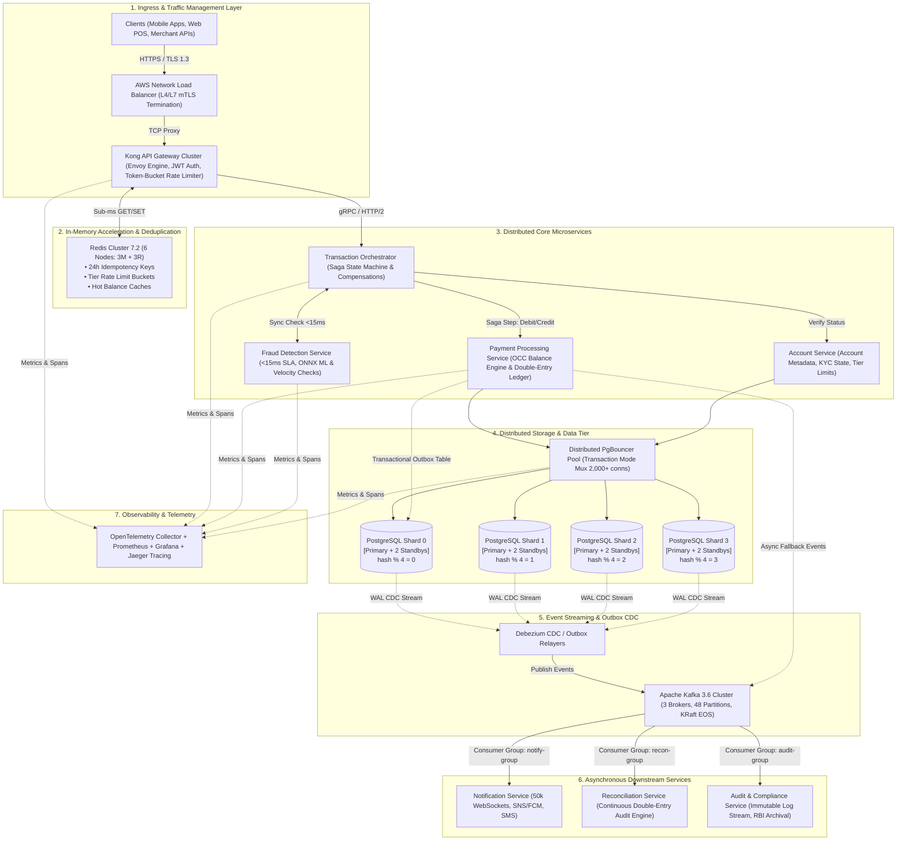

# Day 3: High-Level System Architecture Design (HLD)
**Project:** PayScale High-Throughput Transaction Processing Engine (HTTPE)  
**Target:** 12,000+ TPS Sustained (18,000 TPS Burst) | < 100ms p99 Latency | 99.99% Availability  
**Evaluation:** Architecture Review Board (ARB) Deliverable  

---

## 1. System Architecture Topology Diagram

---

## 2. Comprehensive 13-Component Architecture Breakdown

### 1. API Gateway Layer
- **Responsibility:** Ingress entry point for all client requests; handles TLS 1.3 termination, JWT authentication validation, global and tier-based rate limiting, client IP geolocation, and canary routing.
- **Interfaces:** Receives HTTPS/JSON/REST from AWS NLB; interacts with Redis Cluster for rate limiting counters and token validation; routes authenticated requests via gRPC / HTTP/2 to the Transaction Orchestrator.
- **Technology Choice:** **Kong API Gateway (Enterprise/OSS on Envoy/OpenResty)**. Justified by its sub-3ms p99 latency overhead, non-blocking C/Lua event loop, and low compute cost ($1,200/mo vs $35,000/mo on AWS API Gateway at 31 billion requests).
- **Scaling Strategy:** Auto-scaling group of 4 to 12 instances across 3 AZs scaled on CPU (> 65%) and open connection thresholds.
- **Failure Handling:** Returns `429 Too Many Requests` when rate limits are exceeded; falls back to cached public keys if Auth service is unavailable; drops unhealthy upstream targets automatically via active health probes.

### 2. Load Balancer Layer
- **Responsibility:** L4/L7 high-throughput traffic distribution, TCP health checks, zero-downtime connection draining during rolling deployments, and DDoS mitigation.
- **Interfaces:** Bridges external internet traffic into the private AWS VPC subnets terminating at the Kong API Gateway.
- **Technology Choice:** **AWS Network Load Balancer (NLB)** paired with Application Load Balancer (ALB) capabilities. Handles millions of concurrent connections with ultra-low jitter (< 1ms).
- **Scaling Strategy:** Managed elasticity by AWS across 3 Availability Zones (`ap-south-1a`, `ap-south-1b`, `ap-south-1c`).
- **Failure Handling:** Automatic failover across healthy AZ endpoints in < 1 second.

### 3. Transaction Orchestrator Service
- **Responsibility:** Acts as the brain of the payment processing flow; executes the Distributed Saga State Machine; enforces idempotency; coordinates fraud checks, account balance debit/credits, ledger writes, and compensating rollback actions.
- **Interfaces:** Synchronous inbound gRPC from Kong; synchronous gRPC to Fraud Detection (< 15ms); synchronous gRPC to Payment Service; asynchronous event publishing to Apache Kafka.
- **Technology Choice:** **Custom High-Performance Kotlin / Java 21 Microservice (Virtual Threads) backed by Redis state store & Kafka event log**.
- **Scaling Strategy:** 8 to 24 pods in Kubernetes (EKS), scaled horizontally based on in-flight transaction count (`txn_in_flight > 500`).
- **Failure Handling:** Implements `CB-ORCH` circuit breaker; if downstream payment shards fail, executes automated compensating rollback sagas within 30 seconds.

### 4. Payment Processing Service
- **Responsibility:** Executes atomic balance mutations (debits, credits, holds) using Optimistic Concurrency Control (OCC); computes applicable platform and merchant processing fees; writes double-entry bookkeeping ledger records.
- **Interfaces:** Inbound gRPC from Transaction Orchestrator; outbound SQL over PgBouncer to PostgreSQL shards; publishes transactional state events to Kafka via Outbox tables.
- **Technology Choice:** **Kotlin 1.9 / Spring Boot 3.2 with Netty and HikariCP connection pooling**.
- **Scaling Strategy:** 12 to 36 pods horizontally scaled across availability zones.
- **Failure Handling:** OCC version conflict triggers jittered exponential backoff retries (max 3 attempts); if balance is insufficient, returns immediate `422 Unprocessable Entity` with error code `INSUFFICIENT_FUNDS`.

### 5. Account Service
- **Responsibility:** Manages account lifecycle (CRUD), KYC verification state, tier assignment (Basic, Premium, Merchant), account freeze/unfreeze operations, and daily cumulative transfer limits.
- **Interfaces:** Inbound gRPC from API Gateway and Orchestrator; outbound SQL to PostgreSQL shards via PgBouncer.
- **Technology Choice:** **Java 21 Microservice with Caffeine L1 local cache and Redis L2 cache**.
- **Scaling Strategy:** 6 to 16 pods.
- **Failure Handling:** Read replicas serve account metadata during primary DB failover; account freeze flags are strictly read with read-after-write consistency.

### 6. Notification Service
- **Responsibility:** Dispatches real-time transaction receipts and alerts via 50,000+ persistent WebSockets, Firebase Cloud Messaging (FCM), Apple APNs, SMS gateways (Twilio/Gupshup), and email.
- **Interfaces:** Subscribes to `transaction-events` Kafka topic; manages active WebSocket sessions for mobile/web clients.
- **Technology Choice:** **Node.js / Go WebSocket cluster with Redis Pub/Sub backplane**.
- **Scaling Strategy:** 3 to 12 nodes scaled on active WebSocket connection count (> 10,000 per node).
- **Failure Handling:** Circuit Breaker `CB-NOTIFY` trips after 5 consecutive SMS gateway failures; failed notifications are queued in a Dead Letter Queue (DLQ) for asynchronous retry without blocking transaction completion.

### 7. Fraud Detection Service
- **Responsibility:** Performs real-time risk scoring, velocity checks (e.g., > 3 transfers in 60s), geo-velocity anomalies, and machine learning inference within a strict **15ms SLA**.
- **Interfaces:** Synchronous gRPC call from Transaction Orchestrator; reads hot user behavioral features from Redis Feature Store.
- **Technology Choice:** **Python/C++ Inference Engine running ONNX Runtime with Redis Enterprise Feature Store**.
- **Scaling Strategy:** 4 to 16 compute-optimized (`c6g.2xlarge`) pods.
- **Failure Handling:** Circuit Breaker `CB-FRAUD` (trips on 3 failures / 10s); in Open state, falls back to rule-based heuristic scoring or flags transaction for post-facto asynchronous review while approving low-risk (< ₹2,000) transactions.

### 8. Reconciliation Service
- **Responsibility:** Continuously validates double-entry ledger invariant:
  $$\sum \text{Debit Amounts} = \sum \text{Credit Amounts}$$
  Detects discrepancies between partner bank settlement files and internal ledger records.
- **Interfaces:** Batch reads from PostgreSQL read replicas and consumes `ledger-entries` Kafka topic.
- **Technology Choice:** **Java / Apache Flink streaming reconciliation engine**.
- **Scaling Strategy:** 2 to 4 workers running continuous stream audits.
- **Failure Handling:** Emits `RECONCILIATION_MISMATCH` alert to P1 on-call pager; isolates affected accounts without halting overall engine throughput.

### 9. Audit & Compliance Service
- **Responsibility:** Ingests all state changes, generates RBI-compliant audit trails, enforces PII pseudonymization (DPDPA 2023 compliance), and pushes encrypted compressed logs to AWS S3 Glacier.
- **Interfaces:** Subscribes to Kafka `audit-stream` topic; writes to immutable append-only storage.
- **Technology Choice:** **Go service with AWS S3 Object Lock (WORM - Write Once Read Many)**.
- **Scaling Strategy:** 2 to 6 consumer instances.
- **Failure Handling:** Kafka consumer offset backpressure ensures zero log loss during storage throttling.

### 10. Message Queue / Event Bus (Apache Kafka)
- **Responsibility:** Serves as the central asynchronous nervous system; provides distributed pub/sub event streams, outbox event relaying, and dead-letter queue buffering.
- **Interfaces:** Producers: Payment, Account, and Orchestrator services; Consumers: Notification, Reconciliation, Audit, and Webhook dispatchers.
- **Technology Choice:** **Apache Kafka 3.6 (KRaft mode, 3 Brokers, 48 Partitions, RF=3)**.
- **Scaling Strategy:** Broker scale-up to `r6g.4xlarge` and dynamic partition rebalancing.
- **Failure Handling:** ISR (In-Sync Replicas) = 2 ensures zero data loss upon single broker crash; leader election completes in < 2 seconds.

### 11. Database Layer (Distributed PostgreSQL Shards)
- **Responsibility:** Persistent, ACID-compliant source of truth for all account balances, transactions, and ledger entries.
- **Interfaces:** Receives multiplexed SQL connections from PgBouncer.
- **Technology Choice:** **4 PostgreSQL 16 Shards (12 total EC2 nodes: 4 Primary + 8 Replicas) with Patroni & Raft HA**.
- **Scaling Strategy:** Shard expansion from 4 to 8 shards via consistent hash migration.
- **Failure Handling:** Patroni executes automatic failover to standby replica in < 15 seconds (RTO < 30s, RPO = 0).

### 12. Cache Layer (Redis Cluster)
- **Responsibility:** Low-latency caching for 24-hour transaction idempotency tokens, rate limit sliding windows, and account balance snapshots.
- **Interfaces:** Sub-millisecond TCP connections from Kong Gateway and Core Microservices.
- **Technology Choice:** **Redis Cluster 7.2 (6 nodes: 3 Masters + 3 Replicas, 96 GB aggregate RAM)**.
- **Scaling Strategy:** Cluster node addition from 6 to 12 nodes across 16,384 hash slots.
- **Failure Handling:** Circuit Breaker `CB-CACHE` bypasses cache to query DB primary on Redis cluster partition. Redis Sentinel / Cluster auto-failover promotes replica in < 3 seconds.

### 13. Observability & Telemetry Stack
- **Responsibility:** End-to-end distributed tracing, real-time RED (Rate, Errors, Duration) metrics, custom transaction SLA monitors, and centralized log aggregation.
- **Interfaces:** OpenTelemetry agent sidecars embedded in all services; Prometheus scraper; Grafana dashboards.
- **Technology Choice:** **OpenTelemetry + Prometheus + Grafana + Jaeger + Grafana Loki**.
- **Scaling Strategy:** Distributed Prometheus federation and Loki S3 backend.
- **Failure Handling:** Metric collection uses local memory ring buffers; telemetry failure never degrades transaction critical path.
