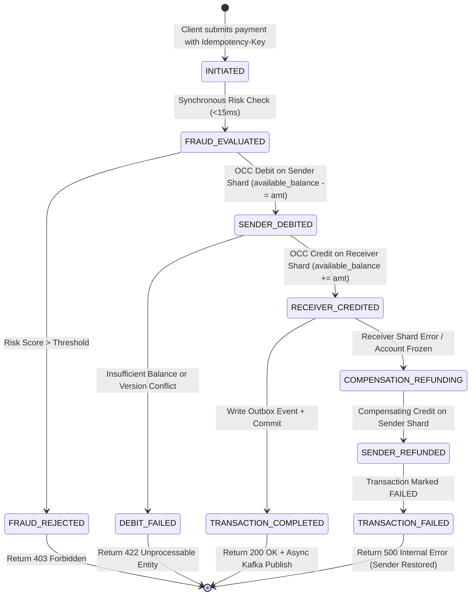

# Day 4: Data Flow Design & Transaction State Machines
**Project:** PayScale High-Throughput Transaction Processing Engine (HTTPE)  
**Author:** Senior Infrastructure Architect  
**Deliverable:** Complete synchronous vs. asynchronous data flow analysis, timeout budgets, and rollback mechanisms  

---

## 1. Synchronous vs. Asynchronous Communication Matrix

To guarantee sub-100ms p99 latency at 12,000+ TPS, we strictly compartmentalize the critical path: only operations strictly required for balance verification and debit authorization run **synchronously**; all ancillary tasks (notifications, analytics, external settlements, ledger archiving) run **asynchronously**.

| Processing Stage | Mode | Protocol | Timeout SLA | Failure / Fallback Strategy |
| :--- | :--- | :--- | :--- | :--- |
| **API Gateway Ingress** | Sync | HTTPS / TLS 1.3 | 10 ms | Token-bucket rate limiting (`429 Too Many Requests`) |
| **Idempotency Verification** | Sync | Redis GET / SETNX | 2 ms | Fast return cached response if key exists |
| **Fraud & Risk Scoring** | Sync | gRPC / HTTP/2 | **15 ms** | `CB-FRAUD` circuit breaker (heuristic score fallback) |
| **Saga Debit (Sender Shard)**| Sync | PgBouncer / SQL | 12 ms | OCC retry with jittered backoff; rollback on zero funds |
| **Saga Credit (Receiver Shard)**| Sync | PgBouncer / SQL | 12 ms | If failed, trigger compensating refund on Sender Shard |
| **Client Response Return** | Sync | JSON HTTP 200/422 | 3 ms | End of user-facing critical path (< 50ms typical) |
| **Outbox CDC to Kafka** | Async | Debezium / WAL | < 100 ms | Transactional Outbox guarantees zero loss |
| **WebSocket / SMS Alerts** | Async | Kafka Consumer | < 500 ms | `CB-NOTIFY` trips to DLQ; does not block payment |
| **Double-Entry Ledger Audit** | Async | Kafka / Flink | < 1,000 ms | Continuous streaming invariant audit |
| **Batch Merchant Settlement**| Async | Scheduled Cron / REST| 300 s | Chunked batching (500 txns/batch) to Banking Switch |

---

## 2. Core Data Flow Deep-Dives

### 2.1 Critical Flow 1: P2P Payment Transaction Saga

The P2P payment flow handles cross-shard or intra-shard money transfers between two user accounts under the Saga pattern.

#### Failure Scenarios Handled in P2P Flow:
1. **Scenario A - High Contention on Sender Account:** If 5 concurrent debits hit the same sender account, the OCC version check prevents write skew. The first update succeeds; subsequent attempts retry up to 3 times with exponential backoff before failing cleanly if balance drops below threshold.
2. **Scenario B - Destination Shard Network Partition:** If Shard B (Receiver) is unreachable during Step 2, the Orchestrator executes a compensating transaction on Shard A (Sender), issuing an atomic `REFUND` ledger entry and restoring the sender's available balance.
3. **Scenario C - Client Network Disconnect After Commit:** If the client connection drops before receiving the HTTP 200 response, the client retries with the same `Idempotency-Key`. The API Gateway / Orchestrator detects the key in Redis and immediately returns the cached `COMPLETED` transaction payload without re-executing any financial state mutation.

---

### 2.2 Critical Flow 2: Batch Merchant Settlement

Merchants accumulate transaction credits throughout the business day. At settlement cut-off (e.g., 23:00 IST), batch payouts are generated and routed to NPCI/NEFT payment switches.

#### Processing Protocol:
1. **Locking & Slicing:** The Settlement Service queries all completed, unsettled transaction records in chunks of 500 merchants to prevent database memory spikes.
2. **Double-Entry Pre-Audit:** The Reconciliation Service calculates:
   $$\text{Sum of Completed Transactions} - \text{MDR Fees} = \text{Payout Total}$$
3. **Idempotent Banking API Dispatch:** Chunked payout instructions are dispatched to partner banking gateways with a deterministic `batch_id`.
4. **Asynchronous Webhook Settlement:** Upon receiving bank confirmation, the merchant's `ledger_balance` is reduced, and the batch is flagged as `SETTLED`.

---

### 2.3 Critical Flow 3: Automated Database Failover (RTO < 30s, RPO = 0)

When a primary PostgreSQL database shard experiences a hardware crash or network isolation:
1. **Detection (0–6s):** Patroni cluster nodes miss 3 consecutive 2-second heartbeats.
2. **Fencing & Promotion (6–10s):** Patroni revokes the primary's DCS lease and promotes the most up-to-date Standby replica (synchronous WAL LSN match) using `pg_promote()`.
3. **Pool Rewiring (10–13s):** PgBouncer configuration is dynamically updated via reload signals to route traffic to the newly promoted primary endpoint.
4. **Application Self-Healing (13–15s):** In-flight application queries that received transient connection resets retry via exponential backoff and commit cleanly on the new primary. Total recovery time: **~13 seconds** (well within the 30-second RTO).
