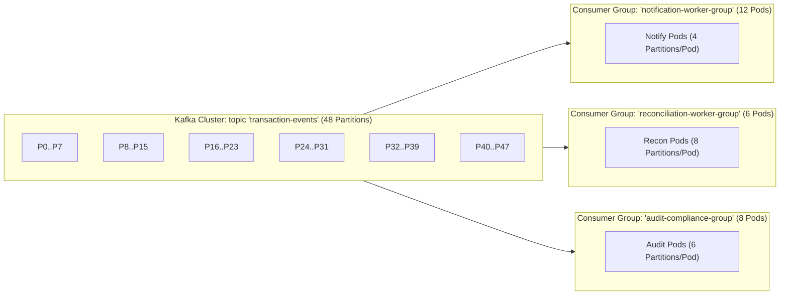
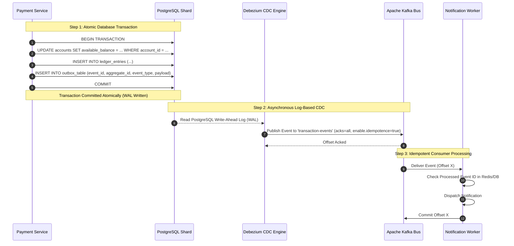

# Day 7: Message Queue Topology & Exactly-Once Semantics (EOS)
**Project:** PayScale High-Throughput Transaction Processing Engine (HTTPE)  
**Author:** Senior Infrastructure Architect  
**Deliverable:** Kafka Topic Architecture, Partition Math, Outbox CDC, and DLQ Policies  

---

## 1. Kafka Topic Topology & Mathematical Partition Sizing

To guarantee linear scalability without partition bottlenecks at 12,000 TPS sustained (18,000 TPS burst), we establish a dedicated topic topology.

### 1.1 Topic Sizing & Configuration Matrix

| Topic Name | Partitions | Replication Factor | Min In-Sync Replicas | Partition Key | Retention Policy | Peak Ingestion Rate |
| :--- | :--- | :--- | :--- | :--- | :--- | :--- |
| `transaction-events` | **48** | 3 | 2 | `account_id` | 7 Days (Delete) | 18,000 msgs/sec |
| `outbox-cdc-events` | **48** | 3 | 2 | `account_id` | 3 Days (Delete) | 18,000 msgs/sec |
| `notification-dispatch`| **24** | 3 | 2 | `user_id` | 24 Hours (Delete)| 15,000 msgs/sec |
| `settlement-batch` | **8** | 3 | 2 | `batch_id` | 30 Days (Compact)| 500 msgs/sec |
| `audit-compliance` | **24** | 3 | 2 | `transaction_id`| 90 Days (Delete)| 36,000 msgs/sec |
| `txn-dead-letter-queue`| **12** | 3 | 2 | `transaction_id`| 30 Days (Delete)| < 50 msgs/sec |

### 1.2 Partition Mathematics & Throughput Proof
Let:
- $T_{\text{target}} = 18,000 \text{ msgs/sec}$ (peak burst).
- $C_{\text{single\_consumer}} \approx 450 \text{ msgs/sec}$ (conservative throughput for a single worker thread executing database/network operations).

The required minimum partition count $P$ is calculated as:
$$P = \frac{T_{\text{target}}}{C_{\text{single\_consumer}}} = \frac{18,000}{450} = 40 \text{ partitions}$$
We select **48 partitions** (divisible by 2, 3, 4, 6, 8, 12, 16, 24, 48), ensuring optimal load balancing across any consumer group pod count ($N \in \{6, 8, 12, 16, 24, 48\}$).

---

## 2. Consumer Group Topology & Workload Mapping

Each consumer group operates independently. If the Notification Service slows down due to external SMS gateway latency, its consumer lag increases without impacting the Reconciliation or Audit services in any way.

---

## 3. Exactly-Once Semantics (EOS) via Transactional Outbox Pattern

The dual-write problem (writing to a database and publishing to Kafka atomically) cannot be solved with naive dual calls because network crashes leave state inconsistent.

---

## 4. Dead Letter Queue (DLQ) & Intelligent Retry Policy

When message processing fails in downstream consumers:
1. **Immediate Retry (1–3 attempts):** Retries within 50ms for transient network errors.
2. **Exponential Jittered Backoff (Attempts 4–5):** Waits $200\text{ms} \times 2^{\text{attempt}} \pm \text{jitter}$.
3. **Dead Letter Routing (After 5 failures):** The poisoned message is routed to `txn-dead-letter-queue` with comprehensive failure headers:
   - `x-original-topic`: `transaction-events`
   - `x-exception-message`: `Connection Timeout to SMS Provider`
   - `x-failed-timestamp`: `2026-09-24T12:00:00Z`
   - `x-retry-count`: `5`
4. **DLQ Replay Tooling:** SREs can inspect messages in the Web UI, trigger bulk reprocessing, or discard invalid events without blocking active Kafka partitions.
