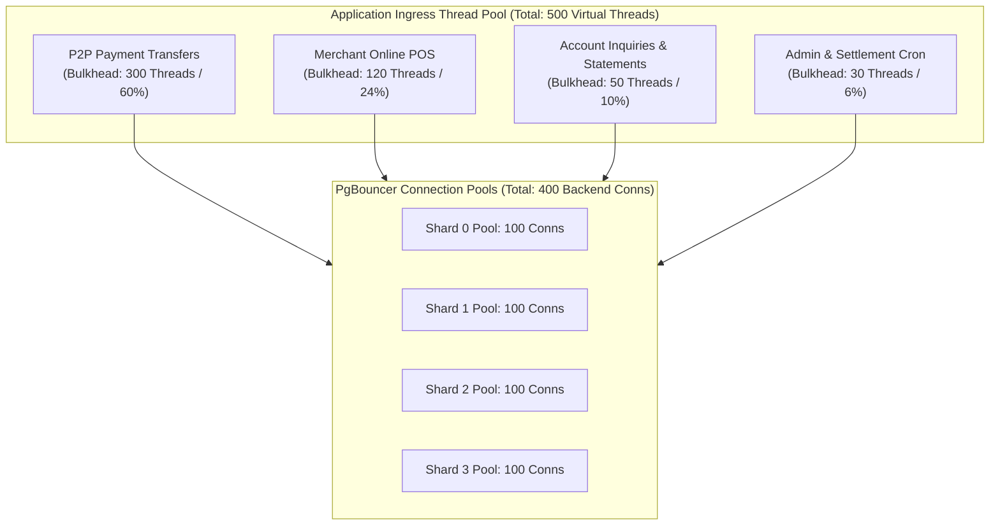

# Day 9: Fault Tolerance, Circuit Breakers & Bulkhead Isolation
**Project:** PayScale High-Throughput Transaction Processing Engine (HTTPE)  
**Author:** Senior Infrastructure Architect  
**Deliverable:** Circuit Breaker Specifications, Bulkhead Isolation Architecture, and Chaos Experiments  

---

## 1. Production Circuit Breaker Instances

To prevent cascading failures across microservices at 12,000+ TPS, we implement 7 specialized circuit breaker instances using sliding-window metrics.

| Circuit Breaker ID | Protected Service | Failure Threshold | Reset Timeout | Half-Open Probes | Fallback Behavior & Degradation Policy |
| :--- | :--- | :--- | :--- | :--- | :--- |
| **CB-FRAUD** | Fraud Detection Service | 3 failures / 10s | 15 seconds | 2 probes | Allow transactions < ₹2,000 with `FLAG_ASYNC_REVIEW` flag; challenge high-value transfers with OTP. |
| **CB-NOTIFY** | Notification Service | 5 failures / 30s | 60 seconds | 3 probes | Route notifications directly to Kafka Dead Letter Queue (DLQ); proceed with transaction commit. |
| **CB-DB-PRIMARY**| Primary PostgreSQL Shard | 2 failures / 5s | 10 seconds | 2 probes | Fast-fail in-flight writes; trigger Patroni auto-failover to Standby. |
| **CB-DB-REPLICA**| Read Replica Shards | 5 failures / 10s | 30 seconds | 2 probes | Route read traffic to Primary Shard (strictly rate-limited to 500 QPS). |
| **CB-CACHE** | Redis Cluster Cache | 3 failures / 5s | 20 seconds | 2 probes | Bypass cache and query database primary directly with connection bulkhead protection. |
| **CB-EXCHANGE** | Exchange Rate Service | 3 failures / 10s | 30 seconds | 1 probe | Use last-known valid exchange rate snapshot with a `STALE_RATE_APPLIED` audit flag. |
| **CB-SETTLEMENT**| Core Banking Payout Switch| 2 failures / 5s | 60 seconds | 1 probe | Queue unsettled batches in PostgreSQL for next scheduled retry window (max 30m). |

---

## 2. Bulkhead Isolation Architecture

Bulkheads prevent a single slow tenant, service, or failure domain from consuming shared application resources (thread pools, database connections, memory buffers).

---

## 3. Retry Policy & Jitter Formula

For all transient network or OCC version conflict retries, we enforce **Decorrelated Exponential Backoff with Full Jitter** to eliminate the Thundering Herd Problem:

$$T_{\text{sleep}} = \min\left(T_{\text{max}}, \; \text{random}(0, \; T_{\text{base}} \times 2^{\text{attempt}})\right)$$

- $T_{\text{base}} = 10\text{ms}$
- $T_{\text{max}} = 100\text{ms}$
- $\text{Max Retries} = 3$

---

## 4. Comprehensive Chaos Engineering Experiments

| Exp ID | Fault Injected | Target / Blast Radius | Hypothesis | Success Criteria | Automated Rollback Procedure |
| :--- | :--- | :--- | :--- | :--- | :--- |
| **CE-001** | `kill -9` on PostgreSQL Shard 1 Primary | Shard 1 Primary Node | Patroni promotes standby in < 15s; in-flight retries succeed; zero data loss (RPO=0). | Recovery $\le 30\text{s}$; error rate $< 0.5\%$; p99 $< 2.5\text{s}$ during failover window. | Patroni restarts container; rejoins cluster as standby. |
| **CE-002** | Inject 500ms network latency to Kafka Brokers | Kafka Producer Network Interface | Outbox table buffers events locally; zero loss; producer lag drains once latency removed. | User transaction latency unaffected (< 35ms); Kafka consumer lag resolves in < 2 min. | `tc qdisc del dev eth0 root` removes injected network delay. |
| **CE-003** | Evict 100% of Redis keys under 12K TPS load | Redis Cluster | Cache misses spike to DB; DB connection pool holds; response times stay < 100ms. | DB pool utilization $< 80\%$; zero DB OOMs; p99 $< 95\text{ms}$. | Warm up cache from read replicas in background. |
| **CE-004** | Terminate 50% of Payment Service Pods | Kubernetes EKS Worker Nodes | Remaining pods handle traffic; HPA provisions replacements within 60 seconds. | 5xx error rate $< 1.0\%$; new pods healthy & serving within 90 seconds. | Scale deployment replica count back to baseline. |
| **CE-005** | Inject 5-second Clock Skew on App Servers | App Server OS NTP Clock | JWT tokens with future timestamps rejected cleanly; OCC CAS vectors remain safe. | Zero duplicate transactions; no balance corruption; NTP self-heals clock drift. | Restart `chronyd` daemon to force time sync. |
